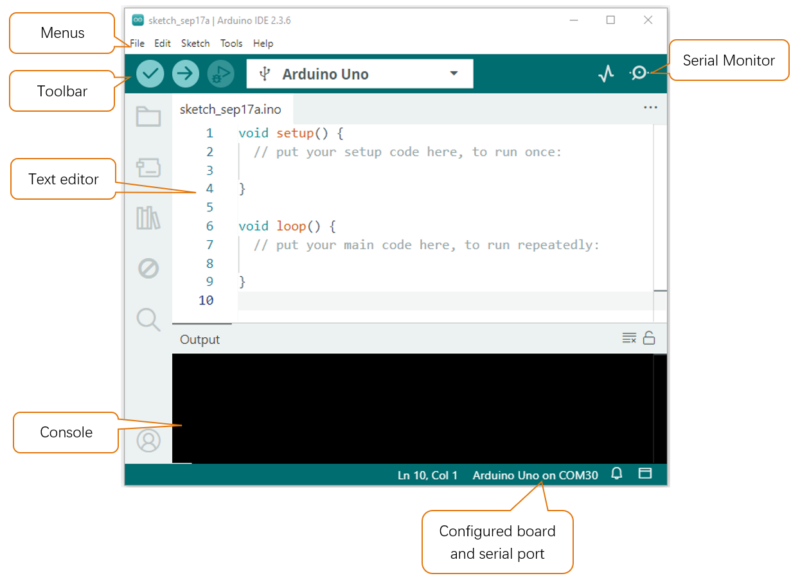

##############################################################################
Arduino IDE
##############################################################################

! Please do NOT skip this chapter even if you have already installed the Arduino IDE.

The control board of the robot is compatible with Arduino IDE. The Arduino IDE is free and open source. We will use it to write and upload code to the control board.

Arduino IDE
*******************************************************************************

Arduino Software (IDE) is used to write and upload the code for Arduino Board.

First, install Arduino Software (IDE): visit https://www.arduino.cc/en/software/

.. image:: ../_static/imgs/Arduino_IDE/Preface03.png
    :align: center

Select and download corresponding installer based on your operating system. If you are a Windows user, please select the "Windows" to download and install the driver correctly.

.. image:: ../_static/imgs/Arduino_IDE/Preface04.png
    :align: center

After the downloading completes, run the installer. For Windows users, there may pop up an installation dialog box of driver during the installation process. When it is popped up, please allow the installation.

After installation is completed, an shortcut will be generated in the desktop.

.. image:: ../_static/imgs/Arduino_IDE/Preface05.png
    :align: center

Run it. The interface of the software is as follows:

Programs written with Arduino IDE are called sketches. These sketches are written in a text editor and are saved with the file extension.ino. The editor has features for cutting/pasting and for searching/replacing text. The console displays text output by the Arduino IDE, including complete error messages and other information. The bottom right-hand corner of the window displays the configured board and serial port. The toolbar buttons allow you to verify and upload programs, open the serial monitor, and access the serial plotter.

.. table::
    :align: center
    :class: table-line
    :width: 80%
    
    +-------------+---------------------------------------------------------------------+
    | |Preface07| | Verify                                                              |
    |             |                                                                     |
    |             | Checks your code for errors compiling it.                           |
    +-------------+---------------------------------------------------------------------+
    | |Preface08| | Upload                                                              |
    |             |                                                                     |
    |             | Compiles your code and uploads it to the configured board.          |
    +-------------+---------------------------------------------------------------------+
    | |Preface09| | Debug                                                               |
    |             |                                                                     |
    |             | Troubleshoot code errors and monitor program running status.        |
    +-------------+---------------------------------------------------------------------+
    | |Preface10| | Serial Plotter                                                      |
    |             |                                                                     |
    |             | Real-time plotting of serial port data charts.                      |
    +-------------+---------------------------------------------------------------------+
    | |Preface11| | Serial Monitor                                                      |
    |             |                                                                     |
    |             | Used for debugging and communication between devices and computers. |
    +-------------+---------------------------------------------------------------------+

.. |Preface08| image:: ../_static/imgs/Arduino_IDE/Preface08.png
.. |Preface09| image:: ../_static/imgs/Arduino_IDE/Preface09.png
.. |Preface10| image:: ../_static/imgs/Arduino_IDE/Preface10.png
.. |Preface11| image:: ../_static/imgs/Arduino_IDE/Preface11.png

Install Boards
*******************************************************************************

Check if “Arduino AVR Boards“ have been installed. It may be automatically installed when the Arduino IDE is first opened. If it is not installed, click ”Install“ to install it.

.. image:: ../_static/imgs/Arduino_IDE/Arduino03.png
    :align: center

Control Board
********************************************************************************

The control board of the robot (Freenove Crawling Robot Controller) is used to drive this robot.

It can connect 18 servos, a WLAN module and a wireless module. There are also some IO and power ports for your use.

First Use
********************************************************************************

Open the example sketch **"Blink"**.

.. image:: ../_static/imgs/Arduino_IDE/Arduino05.png
    :align: center

Click **“Select Board" > "Select other board and port...”.**

.. note:: There may be one or more devices displayed here, ignore them.

.. image:: ../_static/imgs/Arduino_IDE/Arduino06.png
    :align: center

Connect the control board to your computer with a USB cable.

.. image:: ../_static/imgs/Arduino_IDE/Arduino07.png
    :align: center

A new device (port) will appear in the PORTS list on the right, click to select it.

.. note:: Your port name may be different from the following figure, especially on other computer systems.

.. image:: ../_static/imgs/Arduino_IDE/Arduino08.png
    :align: center

:combo:`bg-red font-bolder:Can't find the port?` You may need to install the driver. Please see folder “Drivers”.

**This “Drivers” folder is in the folder that contains this PDF tutorial.**

Find **"Arduino Mega or Mega 2560"** in the BOARDS list on the left and click to select it. Then click **“OK”**.

.. image:: ../_static/imgs/Arduino_IDE/Arduino09.png
    :align: center

Click the **"Verify"** button.

.. image:: ../_static/imgs/Arduino_IDE/Arduino10.png
    :align: center

Figure below shows the code is being compiled.

.. image:: ../_static/imgs/Arduino_IDE/Arduino11.png
    :align: center

Wait a moment for the compiling to be completed. Figure below shows the code size and percentage of space occupation. If there is any error in the code, the compilation will fail and the details will be shown here.

.. image:: ../_static/imgs/Arduino_IDE/Arduino12.png
    :align: center

Click the **"Upload"** button.

Figure below shows the code is being uploaded. 

.. image:: ../_static/imgs/Arduino_IDE/Arduino14.png
    :align: center

Wait a moment for the uploading to be completed.

Usually, you can directly click the “Upload” button, the compilation will automatically proceed first.

:combo:`bg-red font-bolder:Having problems?` Contact us for help! Send mail to: support@freenove.com

We will see the LED marked with "L" on the control board starts blinking. It indicates that the code is running!

So far, we have completed the first use. I believe you have felt the joy of it.