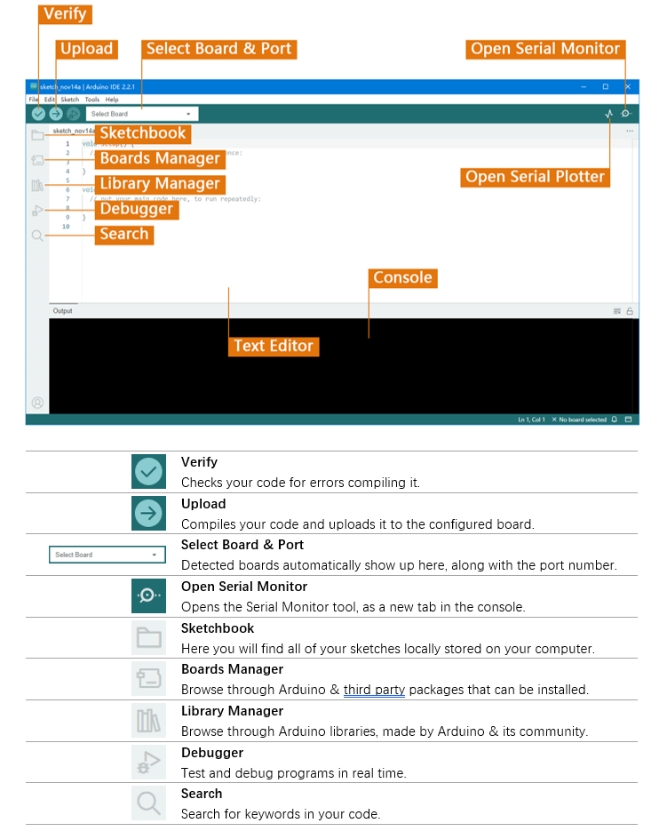
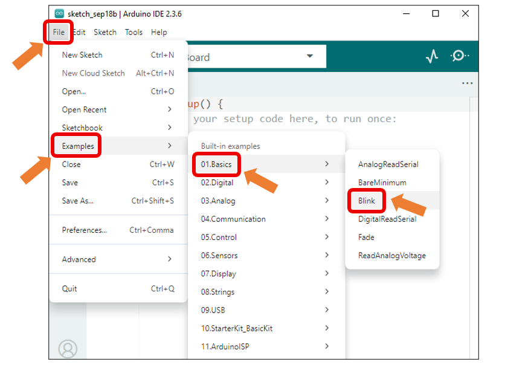
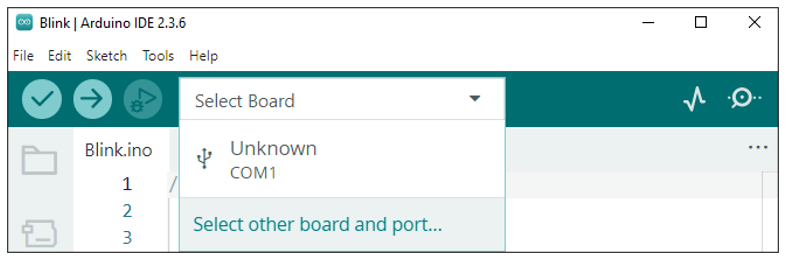
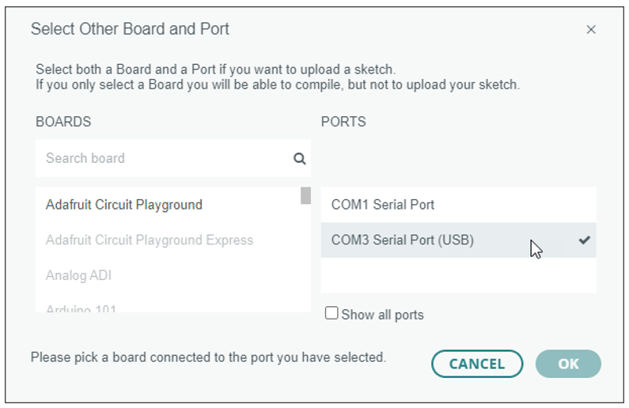
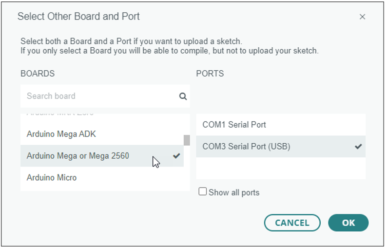

##############################################################################
Arduino IDE
##############################################################################

! Please do NOT skip this chapter even if you have already installed the Arduino IDE.

The control board of the robot is compatible with Arduino IDE. The Arduino IDE is free and open source. We will use it to write and upload code to the control board.

Arduino IDE
*******************************************************************************

Arduino IDE uses C/C++ programming language. Please visit https://www.arduino.cc/reference/en/ for details.

If you want to learn it easily, please visit http://www.freenove.com for kits designed for starters.

**! If you have already installed an earlier version, we recommend uninstalling it before continuing.**

First, install Arduino IDE. Visit https://www.arduino.cc/en/software. Then select and download corresponding installer according to your operating system.

We will explain in the Windows version. The other versions are similar.

Download and complete the installation, an shortcut will be added to your computer's desktop.

Run the Arduino IDE, the interface of it is as follows:

Programs written using Arduino IDE are called sketches and are saved with the file extension.ino.

Please visit https://docs.arduino.cc/software/ide-v2/tutorials/getting-started-ide-v2 for more details.

Install Boards
*******************************************************************************

Check if “Arduino AVR Boards“ have been installed. It may be automatically installed when the Arduino IDE is first opened. If it is not installed, click ”Install“ to install it.

.. image:: ../_static/imgs/Arduino_IDE/Arduino03.png
    :align: center

Control Board
********************************************************************************

The control board of the robot (Freenove Crawling Robot Controller) is used to drive this robot.

It can connect 18 servos, a WLAN module and a wireless module. There are also some IO and power ports for your use.

.. image:: ../_static/imgs/Arduino_IDE/Arduino04.png
    :align: center

First Use
********************************************************************************

Open the example sketch "Blink".

Click “Select Board" > "Select other board and port...”.

.. note:: There may be one or more devices displayed here, ignore them.

Connect the control board to your computer with a USB cable.

.. image:: ../_static/imgs/Arduino_IDE/Arduino07.png
    :align: center

A new device (port) will appear in the PORTS list on the right, click to select it.

.. note:: Your port name may be different from the following figure, especially on other computer systems.

:red:`Can't find the port?` You may need to install the driver. Please see folder “Drivers”.

**This “Drivers” folder is in the folder that contains this PDF tutorial.**

Find **"Arduino Mega or Mega 2560"** in the BOARDS list on the left and click to select it. Then click “OK”.

Click the "Verify" button.

Figure below shows the code is being compiled.

Wait a moment for the compiling to be completed. Figure below shows the code size and percentage of space occupation. If there is any error in the code, the compilation will fail and the details will be shown here.

Click the "Upload" button.

.. image:: ../_static/imgs/Arduino_IDE/Arduino13.png
    :align: center

Figure below shows the code is being uploaded. 

Wait a moment for the uploading to be completed.

Usually, you can directly click the “Upload” button, the compilation will automatically proceed first.

.. image:: ../_static/imgs/Arduino_IDE/Arduino15.png
    :align: center

:red:`Having problems?` Contact us for help! Send mail to: support@freenove.com

We will see the LED marked with "L" on the control board starts blinking. It indicates that the code is running!

.. image:: ../_static/imgs/Arduino_IDE/Arduino16.png
    :align: center

So far, we have completed the first use. I believe you have felt the joy of it.