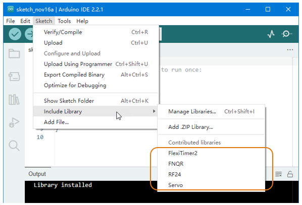
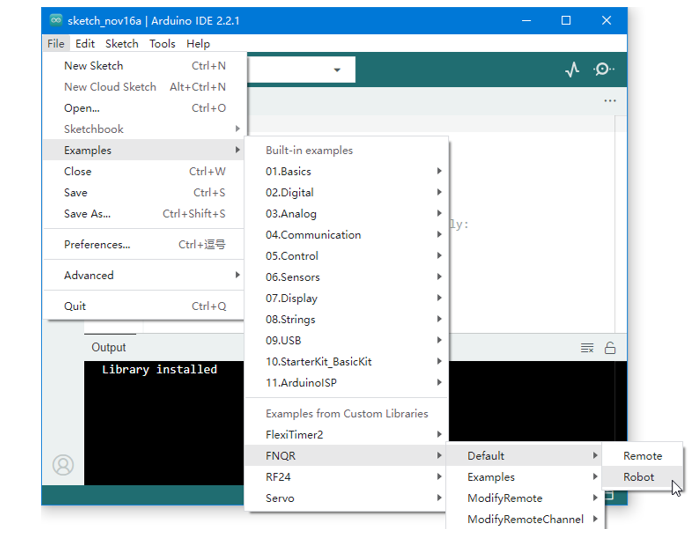
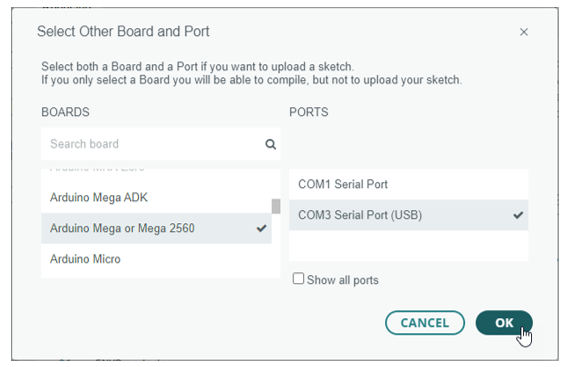
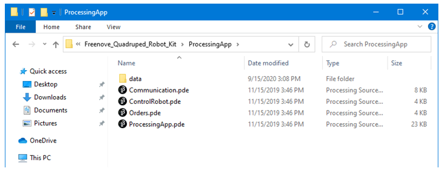

##############################################################################
Assembly
##############################################################################

Now let us start assembling the robot.

**! Please prepare the right batteries and fully charge them first. (See “AboutBattery_for_V3.pdf”)**

Assembling without right batteries will cause installation errors, which may damage the servos.

**! Please read and complete the previous chapters “Arduino IDE” and “Processing IDE” first.**

In the previous chapters we showed you how to install and configure the required software.

**! Please follow the tutorial strictly and do not skip any steps.**

Ask our support for help if you encounter a problem instead of ignoring it.

**! Do not open files in the original ZIP file directly.**

After you download the ZIP file for this product, unzip it before use.

Step 01
*******************************************************************************

First, we need to upload the default sketch to the control board (Freenove Crawling Robot Controller).

Libraries are collections of code that makes programming simple.

The "FNHR" (Freenove Hexapod Robot) library is used to control this robot. We need to add it and other necessary libraries to Arduino IDE.

Open Arduino IDE, click “ **Sketch** ” > “ **Include Library** ” > “ **Add .ZIP Library...** ” to add a library file.

Add all library files in “ **ArduinoLibraries** ” folder. This folder is in the folder that contains this PDF tutorial.

You can find the added libraries in “ **Sketch** ” > “ **Include Library** ”. Make sure all the following libraries have been added.

Now open " **File** " > " **Examples** " > " **FNHR** " > " **Default** " > " **Robot** ".

Connect the control board to your computer with a USB cable.

Click “ **Select Board** " > " **Select other board and port...** ” to select your board and port.

.. note:: Your port name may be different from the following figure. See previous chapter “Arduino IDE”.

Then click the “ **Upload** ” button to upload the sketch to the control board.

Wait for uploading. It will take a few seconds.

Once you see "Done uploading", it means the upload is successful.

Step 02
******************************************************************************

Now we need to run a Processing sketch. It will allow us to configure the control board.

We also need to add library to Processing IDE.

We can add library online. Click “ **Sketch** ” > “ **Import Library...** ” > " **Mamage Libraries...** " to open " **Contribution Manager** ".

Find " **ControlP5** " in the " **Libraries** " tab, and click to select it.

Then click on the “ **Install** ” button at the bottom right.

After the installation succeeds, close “Contribution Manager” window.

**! If you cannot complete the online installation, you can install it offline.**

Find “controlP5.zip” in “ProcessingLibraries” folder. This folder is in the folder that contains this PDF tutorial. Then unzip it to "libraries" folder in "File" > "Preferences..." > "Sketchbook folder".

After library is installed, open " **Freenove_Hexapod_Robot_Kit\\ProcessingApp\\ProcessingApp.pde** " with Processing IDE. This file is in the folder that contains this PDF tutorial.

.. note::

    1.	Make sure you have unzipped the downloaded file.

    2.	Keep the files in same folder. Do not seprate them.

Click the “Run” button, then the Processing App window appears.

Now let us try it. Connect the control board to your computer via a USB cable.

Select " **SERIAL** " in Processing App, then click " **CONNECT** ".

Wait for processing. It may take a few seconds. Do NOT click again when it's processing.

When the "CONNECT" button changes to "DISCONNECT", it means the connection is successful.

**! If the connection is unsuccessful, the default sketch may not have been uploaded successfully.**

Go back to “Step 01”, upload the default sketch to the control board and then try again.

:red:`Having problems?` Contact us for help! Send mail to: `support@freenove.com <support@freenove.com>`_

Click " **DISCONNECT** " button to disconnect.

Step 03
********************************************************************************

Now we will make a test and then set the control board to installation mode.

**Take out all the servos and connect all of them to the control board** (yellow wire of servo to S, red to +, black to -). Servos can be connected randomly to the port 22~39.

(The name of the port is marked on the front of the control board.)

.. image:: ../_static/imgs/Assembly/Assembly15.png
    :align: center

Then install your batteries and keep power off.

Connect the control board to computer via USB cable. Then open Processing App and click “ **CONNECT** ”.

After the connection succeeds, turn on the power. The servos will rotate and then stop. The battery voltage will be displayed on the Processing App.

**! The battery voltage should be around 8.0~8.4V.**

If the voltage is less than 8V, please charge the batteries and then try again. If you still get the same result, maybe you have wrong batteries. Please check the type of your battery or check whether there is a protective board. Refer to “AboutBattery_for_V3.pdf” for detailed information about battery.

If there is no problem with the voltage, then we need to set the control board to installation mode.

Click " **INSTALLATION** " on the top. Wait for processing and the servos will rotate again.

Click “ **DISCONNECT** ” to disconnect. The control board will restart and the servos will rotate again.

**! The LED "L" on the control board now should flash three times at intervals.**

**It is indicating that the control board is under installation mode.**

If the LED L does not flash like this, you need to use Processing App to set the control baord again.

You have to do this step correctly. Otherwise, it will cause installation errors and damage the servos.

If you meet problems, check your batteries or ask our support team for help.

**! Switch the power off, disconnect the USB cable, remove the batteries and disconnect all the servos.**

Now let us learn about the signal LED (LED “L” on the control board), which can indicate current state of the robot. You should always observe it, which is very useful. See “SignalLED.mp4” in “Videos” folder.

The signal LED will flash several times every few seconds (circularly).

In each cycle, if the LED lights up several times and then stays OFF, it indicates different working mode:

The working mode of the robot can be set through Processing App. The robot will remember the working mode you set, even if you restart the power, the robot will still enter the mode you set originally.

In each cycle, if the LED goes off several times and then stays ON, it indicates an error state:

(Only applicable to V2.0 and later versions control board.)

The robot will stop all movements and cut off power of all servos when there is an error. You must troubleshoot the error before you can continue to use it.

Step 04
*******************************************************************************

Now let us assemble the robot.

**! Make sure the batteries are correct and the control board has been set to the installation mode.**

**! Please assemble and use the robot on a smooth surface such as a desk.**

**Assembling and using the robot on rough surfaces such as carpets will damage the servos.**

.. table:: 
    :align: center
    :class: table-line
    :width: 90%

    +----------------------------------------------------------------------------------------------------+
    | Place disc servo arm on the following acrylic plate.                                               |
    |                                                                                                    |
    | (Disc servo arm and servo are packed together.)                                                    |
    |                                                                                                    |
    | |Assembly21|                                                                                       |
    +----------------------------------------------------------------------------------------------------+
    | The correct location is as below.                                                                  |
    |                                                                                                    |
    | |Assembly22|                                                                                       |
    +----------------------------------------------------------------------------------------------------+
    | Rotate disc servo arm to align its hole with the hole on the acrylic plate.                        |
    |                                                                                                    |
    | |Assembly23|                                                                                       |
    +----------------------------------------------------------------------------------------------------+
    | When all holes align:                                                                              |
    |                                                                                                    |
    | |Assembly24|                                                                                       |
    +----------------------------------------------------------------------------------------------------+
    | Use the screws to fix disc servo arm to acrylic plate.                                             |
    |                                                                                                    |
    | If a package of M1.2*7 self-tapping screws cannot be found, it may be packed in the servo package. |
    |                                                                                                    |
    | |Assembly25|                                                                                       |
    +----------------------------------------------------------------------------------------------------+
    | Tighten the screws as below.                                                                       |
    |                                                                                                    |
    | |Assembly26|                                                                                       |
    +----------------------------------------------------------------------------------------------------+
    | Use the same screws to fix other holes of disc servo arm.                                          |
    |                                                                                                    |
    | |Assembly27|                                                                                       |
    +----------------------------------------------------------------------------------------------------+
    | Use the same size of screws to fix 5 other disc servo arms to acrylic plate.                       |
    |                                                                                                    |
    | |Assembly28|                                                                                       |
    +----------------------------------------------------------------------------------------------------+

Step 05
*******************************************************************************

.. table:: 
    :align: center
    :class: table-line
    :width: 90%

    +--------------------------------------------------------------------------------------+
    | Use the same size of screws to fix 2 disc servo arms to the following acrylic plate. |
    |                                                                                      |
    | |Assembly29|                                                                         |
    +--------------------------------------------------------------------------------------+
    | Assemble 5 other acrylic plates as below.                                            |
    |                                                                                      |
    | |Assembly30|                                                                         |
    +--------------------------------------------------------------------------------------+

Step 06
*******************************************************************************

.. table:: 
    :align: center
    :class: table-line
    :width: 90%

    +----------------------------------------------------------------------------------+
    | Use screws and nuts to fix servo to the following acrylic plate.                 |
    |                                                                                  |
    | |Assembly31|                                                                     |
    +----------------------------------------------------------------------------------+
    | Fix them as below. Note the position of the servo shaft.                         |
    |                                                                                  |
    | |Assembly32|                                                                     |
    +----------------------------------------------------------------------------------+
    | Assemble 5 other acrylic plates.                                                 |
    |                                                                                  |
    | Note the direction of acrylic plates. Two of them are opposite to the other two. |
    |                                                                                  |
    | |Assembly33|                                                                     |
    +----------------------------------------------------------------------------------+

Step 07
*******************************************************************************

.. table:: 
    :align: center
    :class: table-line
    :width: 90%

    +-----------------------------------------+----------------------------------------+
    | Use screws and nuts to fix servo to the | Fix them as below. Note the position   |
    |                                         |                                        |
    | following acrylic plate.                | of the servo shaft.                    |
    |                                         |                                        |
    | |Assembly34|                            | |Assembly35|                           |
    +-----------------------------------------+----------------------------------------+
    | Assemble 5 other acrylic plates.                                                 |
    |                                                                                  |
    | Note the direction of acrylic plates. Two of them are opposite to the other two. |
    |                                                                                  |
    | |Assembly36|                                                                     |
    +----------------------------------------------------------------------------------+

Step 08
**********************************************************************************

.. table:: 
    :align: center
    :class: table-line
    :width: 90%

    +-----------------------------------------+----------------------------------------+
    | Use screws and nuts to fix servo to the | Fix them as below. Note the position   |
    |                                         |                                        |
    | following acrylic plate.                | of the servo shaft.                    |
    |                                         |                                        |
    | |Assembly37|                            | |Assembly38|                           |
    +-----------------------------------------+----------------------------------------+
    | Assemble 5 other acrylic plates.                                                 |
    |                                                                                  |
    | Note the direction of acrylic plates. Two of them are opposite to the other two. |
    |                                                                                  |
    | |Assembly39|                                                                     |
    +----------------------------------------------------------------------------------+

Step 09
**********************************************************************************

.. table:: 
    :align: center
    :class: table-line
    :width: 90%

    +-----------------------------------------+----------------------------------------+
    | Use screws and nuts to fix servo to the | Fix them as below. Three sets of them  |
    |                                         |                                        |
    | following acrylic plate.                | need to be assembled.                  |
    |                                         |                                        |
    | |Assembly40|                            | |Assembly41|                           |
    +-----------------------------------------+----------------------------------------+
    | Use screws and nuts to fix two parts    | Fix them as below. Three sets of them  |
    |                                         |                                        |
    | assembled before.                       | need to be assembled.                  |
    |                                         |                                        |
    | |Assembly42|                            | |Assembly43|                           |
    +-----------------------------------------+----------------------------------------+
    | After the assembly is completed, the following 6 components are obtained.        |
    |                                                                                  |
    | Note that two of them are different from the other two.                          |
    |                                                                                  |
    | |Assembly44|                                                                     |
    +----------------------------------------------------------------------------------+

Step 10
*********************************************************************************

.. table:: 
    :align: center
    :class: table-line
    :width: 90%

    +----------------------------------------------------------------------------------------------------------------+
    | Use screws and brass standoffs to fix control board to the following part assembled before.                    |
    |                                                                                                                |
    | |Assembly45|                                                                                                   |
    +----------------------------------------------------------------------------------------------------------------+
    | Fix them as below.                                                                                             |
    |                                                                                                                |
    | |Assembly46|                                                                                                   |
    +----------------------------------------------------------------------------------------------------------------+
    | Install batteries for the control board.                                                                       |
    |                                                                                                                |
    | **! You have to install the right batteries that are fully charged. (Refer to “AboutBattery_for_V3.pdf”)**     |
    |                                                                                                                |
    | Assembling the robot without right batteries will cause installation errors and damage the servos.             |
    |                                                                                                                |
    | |Assembly47|                                                                                                   |
    +----------------------------------------------------------------------------------------------------------------+
    | Make sure the power is turned off, and then connect all servos to control board.                               |
    |                                                                                                                |
    | (yellow wire of servo to S, red to +, black to -)                                                              |
    |                                                                                                                |
    | (servos can be connected randomly to port 22~39)                                                               |
    |                                                                                                                |
    | (The name of the port is marked on the front of the control board.)                                            |
    |                                                                                                                |
    | |Assembly48|                                                                                                   |
    +----------------------------------------------------------------------------------------------------------------+

:red:`! Keep all servos connected to the control board unless they are required to disconnect.`

.. |Assembly48| image:: ../_static/imgs/Assembly/Assembly48.png

Step 11
********************************************************************************

Turn on the power. The servos will rotate and then stop.

**! Keep power on unless it is required to turn off.**

**! The wires of servos are not shown in the future steps.**

.. table:: 
    :align: center
    :class: table-line
    :width: 90%

    +------------------------------------------------------------------------------------------------------------+
    | Use screws to fix the 6 parts assembled before.                                                            |
    |                                                                                                            |
    | Please note the installation angle of 6 parts. (Refer to the installation result at the end of this step.) |
    |                                                                                                            |
    | ! When installing, you must keep the power on and all servos connected.                                    |
    |                                                                                                            |
    | |Assembly49|                                                                                               |
    +------------------------------------------------------------------------------------------------------------+
    | Fix them as below.                                                                                         |
    |                                                                                                            |
    | |Assembly50|                                                                                               |
    +------------------------------------------------------------------------------------------------------------+
    | When the power is turned on, the angles of 6 parts should be as shown below.                               |
    |                                                                                                            |
    | Please try to get them close to the required angle. A small deviation is acceptable.                       |
    |                                                                                                            |
    | We will correct the deviation in future calibration step.                                                  |
    |                                                                                                            |
    | |Assembly51|                                                                                               |
    +------------------------------------------------------------------------------------------------------------+

Step 12
********************************************************************************

.. table:: 
    :align: center
    :class: table-line
    :width: 90%

    +------------------------------------------------------------------------------------------------------------------------------------------------+
    | Use the same sizes of screws to fix 6 parts assembled before.                                                                                  |
    |                                                                                                                                                |
    | Please note the installation angle of 6 parts. (Refer to the installation result at the end of this step.)                                     |
    |                                                                                                                                                |
    | **! When installing, except tightening the screws, you must keep the power ON and all servos connected.**                                      |
    |                                                                                                                                                |
    |                                                                                                                                                |
    | When you tighten the screws, it may be obstructed by other parts. You can turn off the power                                                   |
    |                                                                                                                                                |
    | temporarily and rotate the servo to facilitate tightening the screws. When you complete tightening the                                         |
    |                                                                                                                                                |
    | screws, you need turn on the power first, then continue following steps.                                                                       |
    |                                                                                                                                                |
    | |Assembly52|                                                                                                                                   |
    +------------------------------------------------------------------------------------------------------------------------------------------------+
    | When the power is turned on, the angle of 6 parts should be shown as below.                                                                    |
    |                                                                                                                                                |
    | Please try to get them close to the required angle. A small deviation is acceptable.                                                           |
    |                                                                                                                                                |
    | We will correct the deviation in future calibration step.                                                                                      |
    |                                                                                                                                                |
    | |Assembly53|                                                                                                                                   |
    +------------------------------------------------------------------------------------------------------------------------------------------------+

Step 13
********************************************************************************

.. table:: 
    :align: center
    :class: table-line
    :width: 90%

    +------------------------------------------------------------------------------------------------------------------------------------------------+
    | Use the same sizes of screws to fix 6 parts assembled before.                                                                                  |
    |                                                                                                                                                |
    | Please note the installation angle of 6 parts. (Refer to the installation result at the end of this step.)                                     |
    |                                                                                                                                                |
    | ! When installing, except tightening the screws, you must keep the power ON and all servos connected.                                          |
    |                                                                                                                                                |
    | |Assembly54|                                                                                                                                   |
    +------------------------------------------------------------------------------------------------------------------------------------------------+
    | When the power is turned on, the angle of 6 parts should be shown as below.                                                                    |
    |                                                                                                                                                |
    | Please try to get them close to the required angle. A small deviation is acceptable.                                                           |
    |                                                                                                                                                |
    | We will correct the deviation in future calibration step.                                                                                      |
    |                                                                                                                                                |
    | |Assembly55|                                                                                                                                   |
    +------------------------------------------------------------------------------------------------------------------------------------------------+

.. |Assembly54| image:: ../_static/imgs/Assembly/Assembly54.png

Step 14
********************************************************************************

**! Turn off the power and pull off all the wires of servos.**

.. table:: 
    :align: center
    :class: table-line
    :width: 90%

    +----------------------------------------------------------------------------------------------------+
    | Then reconnect the servos to control board, the ports they should be connected to are shown below. |
    |                                                                                                    |
    | ! The view of the picture below is from the bottom of the robot (you can see the battery).         |
    |                                                                                                    |
    | ! The name of the port is marked on the front of the control board.                                |
    |                                                                                                    |
    | |Assembly56|                                                                                       |
    +----------------------------------------------------------------------------------------------------+

Now, check if you have installed the servos correctly.

Hold up the robot and turn on the power. Check whether the posture of the robot is close to that on the installation page of the Processing App.

**! If there is a lot of difference, it means that the servos have not been installed correctly.**

Please return to the “Step 1” to reinstall.

If there is not much difference, turn off the power and continue.

.. table:: 
    :align: center
    :class: table-line
    :width: 90%

    +----------------------------------------------------------------------+
    | Use cable tidy to arrange the wires of servos.                       |
    |                                                                      |
    | Do not wrap the wires too tight, so that the servos can move freely. |
    |                                                                      |
    | |Assembly58|                                                         |
    +----------------------------------------------------------------------+

Step 15
*********************************************************************************

.. table:: 
    :align: center
    :class: table-line
    :width: 90%

    +------------------------------------------------+
    | Use screws to fix the following acrylic plate. |
    |                                                |
    | |Assembly59|                                   |
    +------------------------------------------------+
    | Fix it as below.                               |
    |                                                |
    | |Assembly60|                                   |
    +------------------------------------------------+

Step 16
*********************************************************************************

.. table:: 
    :align: center
    :class: table-line
    :width: 90%

    +-----------------------------------+
    | Fix WLAN module to control board. |
    |                                   |
    | |Assembly61|                      |
    +-----------------------------------+
    | Fix it as below.                  |
    |                                   |
    | |Assembly62|                      |
    +-----------------------------------+

Step 17
*******************************************************************************

At the end of the assembly, let us calibrate the servos.

Keep the power off.

Connect the robot with Processing App. After the connection succeeds, click "CALIBRATION" on the top.

Turn on the power. The robot will move to the following posture, indicating it is already in calibration mode.

**! If there is a lot of difference, it means that the servos have not been connected correctly.**

Please return to the “Step 14” to reconnect.

Put the robot on the calibration graph. The bottom of the robot should coincide with the specific outline in the graph. USB interface should also coincide with the mark in the graph.

If the calibration graph is missing or damaged, you can print a copy. Print the "CalibrationGraph_for_V3.pdf" by 1:1 (100%) on A4 paper.

Then start calibrate. Select " **LEG1** ", and then click " **X+** ", " **X-** ", " **Y+** ", " **Y-** " and " **Z+** ", " **Z-** ", until the end of Leg1 is aligned with the black dots in the graph.

**! Please note that each click will only move the leg by 1mm, so you may need to click many times.**

You can use keyboard to move the leg. The key is marked in brackets on the button.

Then select the " **LEG2** ", " **LEG3** ", " **LEG4** ", " **LEG5** " and " **LEG6** " to move other legs to corresponding dots as shown below.

Click " **CONFIRM** " and the calibration data will be stored in the robot.

Click " **VERIFY** ", and then the robot will restore to the state before calibration. Then converted to the state after calibration, which indicates that the calibration is completed. If the end of legs is not aligned with the dots, click “ **RESET** ” and restart from moving the legs to try again.

The calibration needs to be executed only once. Its data is stored in EEPROM. It will not be changed if you upload the default sketch again. If you disassemble the robot, replace the servo or control board, you need to calibrate the robot again. If you are not satisfied with the results of the latest calibration, you can also choose to calibrate again.