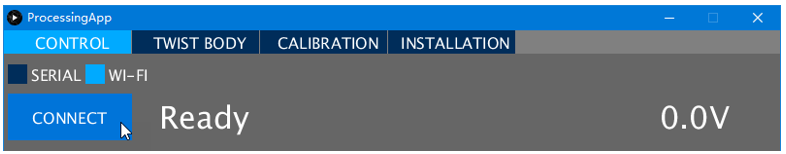
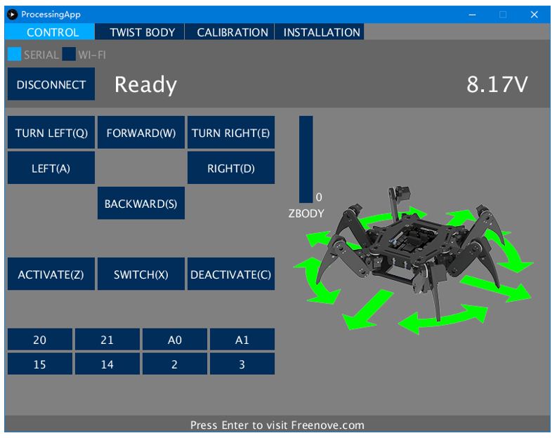
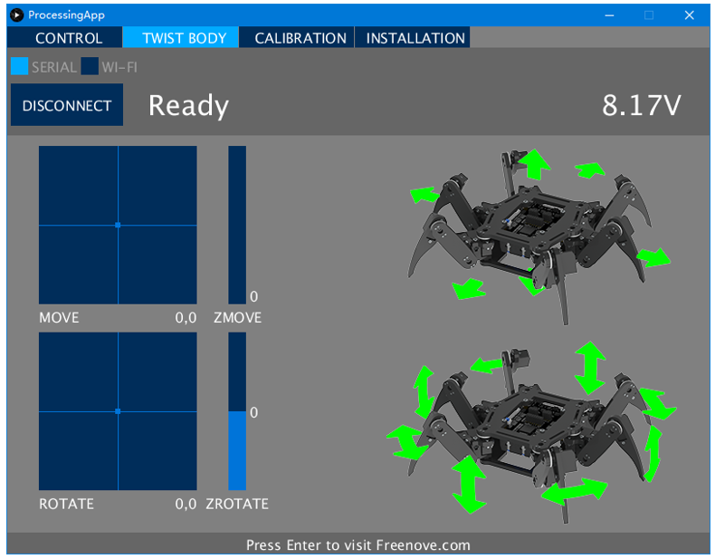
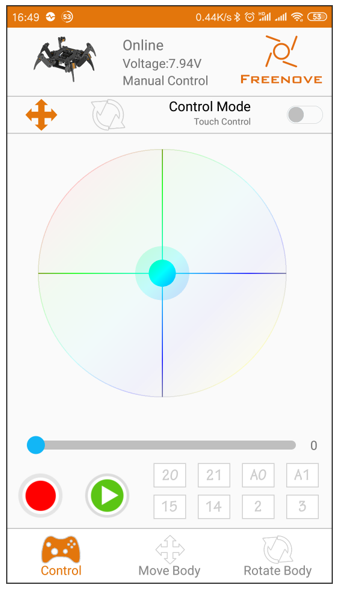
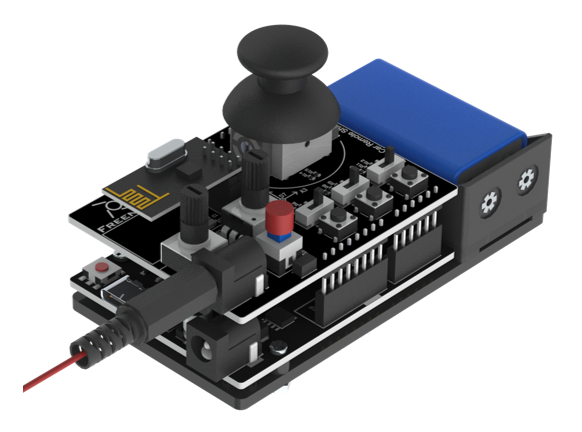
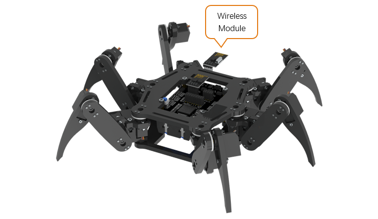
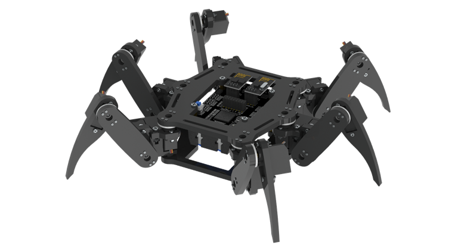
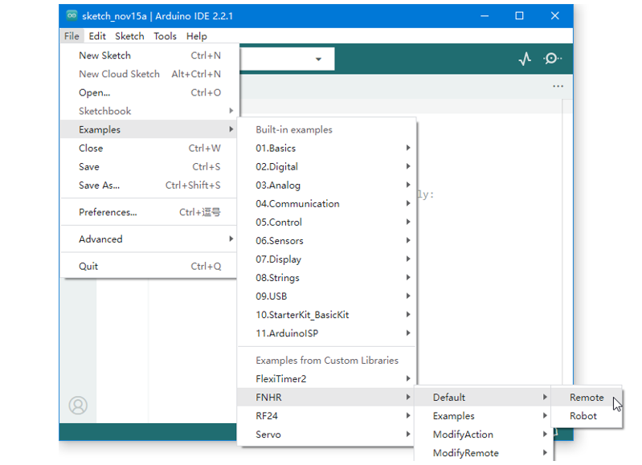
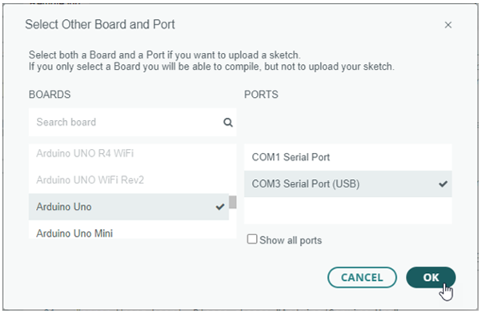
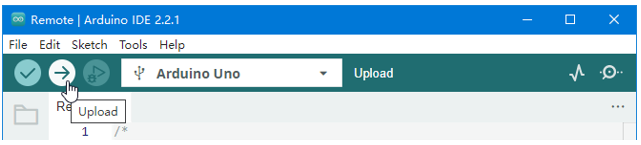

##############################################################################
Default Functions
##############################################################################

Now we can control the robot.

Use Computer
*******************************

Now you can connect the robot through WLAN(Wi-Fi). Turn on the switch, the robot will create a Wi-Fi hotspot named " **Freenove Hexapod Robot** " with password " **Freenove** " (case sensitive) in a few seconds. Connect the computer to this hotspot, select " **WI-FI** " in Processing App, and then click " **CONNECT** " button.

! If the Processing App cannot connect to the robot, please try the following:

1.	Check if the WLAN module is installed correctly.

2.	Fully charge the battery.

3.	Go back to step 01 and upload the default sketch for the robot again.

:red:`Having problems?` Contact us for help! Send mail to: support@freenove.com

In the " **CONTROL** " page, you can control the basic functions of the robot.

You can execute the following operation:

- Forward, backward, left, right, turn left, turn right and change body's height.

- Switch active mode and sleep mode. Sleep mode can help to save the power of batteries.

- Switch output state of IO ports. You can connect and control some output modules.

You can use keyboard to move the leg. The key is marked in brackets on the button.

In the " **TWIST BODY** " page, you can control the robot to move and rotate body in the place where it stays.

You can execute the following operation:

- Use mouse to click on the "MOVE" box and "ZMOVE" slider, the robot body will move to the corresponding location.

- Use mouse to click on the “ROTATE" box and "ZROTATE" slider, the robot body will rotate to the corresponding posture.

If there is no action command for about 10 seconds, the robot will switch into sleep mode automatically to save power. Any command can activate the robot again.

Use Android Devices or iPhone
******************************

You can use Android phone or tablet or iPhone to control this robot.

First, install Freenove App for your device. Visit http://freenove.com/app or:

- For Android, search and install “Freenove” on Google Play. 

- For iPhone, search and install “Freenove” on App store.

After the installation is completed, connect your device to the Wi-Fi hotspot of the robot.

The name of Wi-Fi hotspot is " **Freenove Hexapod Robot** " and the password is " **Freenove** " (case sensitive).

Open Freenove App and select “ **Freenove Hexapod Robot Kit** ”. The following interface will be displayed.

The App will connect the robot automatically. The online state will appear on the top. If the offline state appears, you can touch the robot logo on the top left corner to reconnect.

This APP is similar to the Processing App. You can explore it by yourself. There is also a manual about it:

https://github.com/Freenove/Freenove_App_for_Android/raw/master/Tutorial.pdf

:red:`Having problems?` Contact us for help! Send mail to: support@freenove.com

Use Remote
******************************

You can also use the remote to control this robot if you have purchased it.

Please refer to tutorial (https://freenove.com/fnk0028) to assemble the remote first.

The assembled remote is shown below (the wires are not fully shown in the figure).

(The color of the board may be black or blue.)

There are two wireless modules packed with the remote. One has been installed on the remote. Turn off the power of the robot and then install the other one to it.

+-------------------------------------------+
| Fix wireless module to the control board. |
|                                           |
| |Default_Functions05|                     |
+-------------------------------------------+
| Fix it as below.                          |
|                                           |
| |Default_Functions06|                     |
+-------------------------------------------+

Now, upload sketch for remote. Open " **File** " > " **Examples** " > " **FNHR** " > " **Default** " > " **Remote** ".

Click “ **Select Board** " > " **Select other board and port...** ”. Then connect the remote to your computer with a USB cable. A new device (port) will appear in the PORTS list on the right, click to select it.

.. note:: Your port name may be different from the following figure. See previous chapter “Arduino IDE”.

Find " **Arduino Uno** " in the BOARDS list on the left and click to select it. Then click “ **OK** ”.

.. note:: The board of remote is different from the board of robot.

Click the “ **Upload** ” button to upload the sketch to the remote.

Install a 9V battery for the remote or connect it to any available USB port. Turn on the power switch of remote and robot. If a wireless connection is established between the remote and the robot, the LED3 on remote will light up or flash. Then you can use the remote to control the robot.

The remote has 3 toggle switches and 3 buttons. Each toggle switch is connected to the button closer to it. Turn on or turn off these switches or buttons to control the robot under different mode:

- **Only turn on S1:** 
  
  You can use the joystick to control the robot to move. The robot will always face in one direction.
    
  Press the joystick to swich between active mode and sleep mode.

- **Turn on S1 and S2:** 
  
  You can use the joystick to control the robot to move and turn.
  
  Press the joystick to swich between active mode and sleep mode.

- **Only turn on S2:** 
  
  You can use the joystick to control the robot to move body in place.

- **Only turn on S3:** 
  
  You can use the joystick and POT1 to control the robot to rotate body in place.

- **Turn on S2 and S3:** 

  Move body when only S2 is turned on, and then turn on S3 to rotate body based on the moving body position.

In any case, you can rotate POT2 to adjust the height of robot body.

**! If the remote cannot control the robot, please try the following:**

1.	Check if the wireless modules are installed correctly.

2.	Fully charge the battery.

3.	Upload the default sketch for the remote again. Only turn on S1.

4.	Go back to “Step 01” and upload the default sketch for the robot again.

:red:`Having problems?` Contact us for help! Send mail to: support@freenove.com