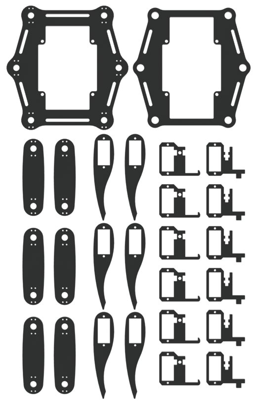
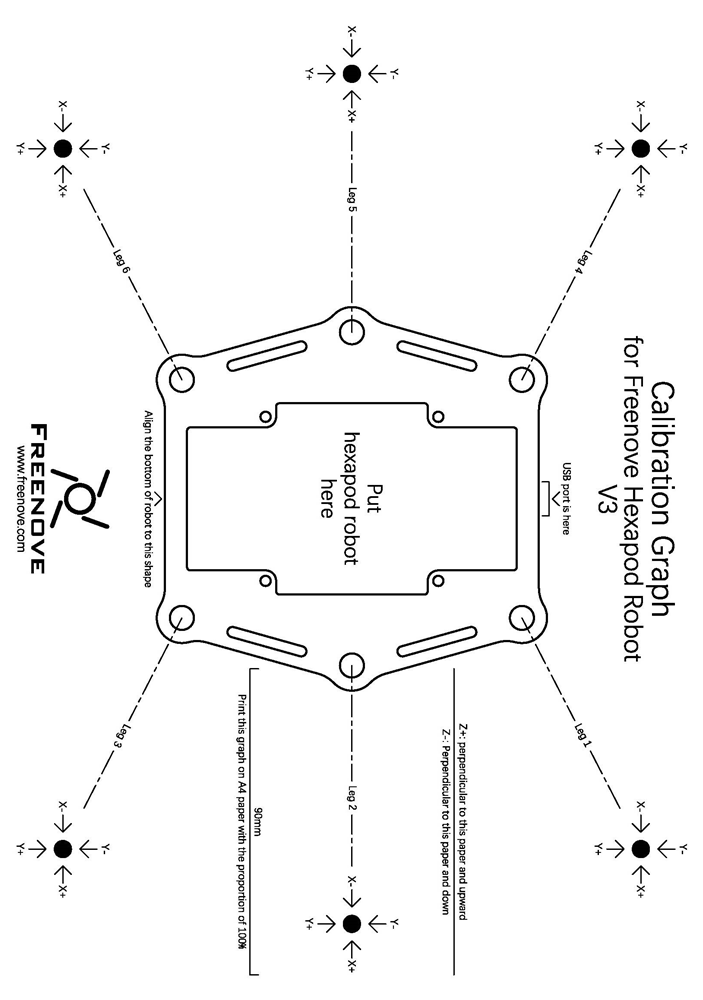
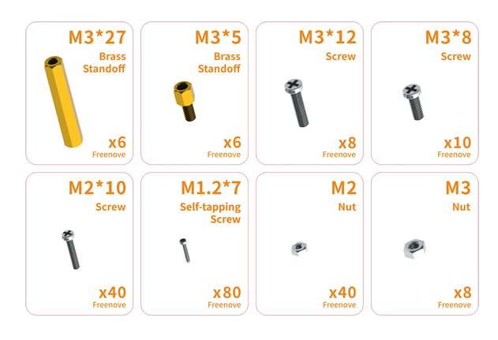
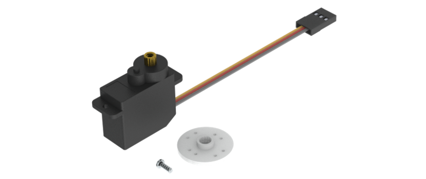
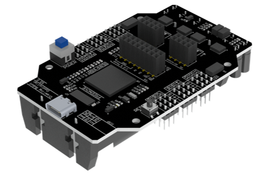
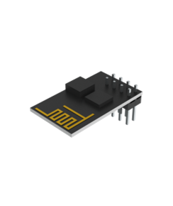
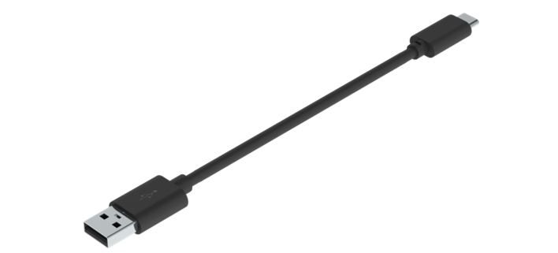
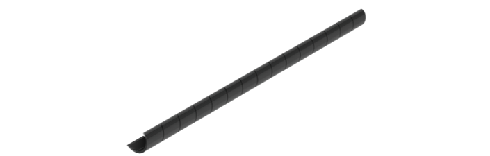
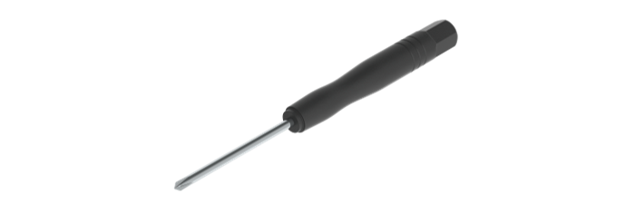

##############################################################################
List
##############################################################################

Acrylic Parts
******************************************************************************

The surface of the acrylic parts is covered with a layer of protective film, you need to remove it first.

Some holes in the acrylic parts may have residues, you also need to clean them before using.

Calibration Graph
******************************************************************************

Mechanical Parts
******************************************************************************

.. note:: If a package of M1.2*7 self-tapping screws cannot be found, it may be packed in the servo package.

Dynamic Parts
*******************************************************************************

Servo Package x18

Electronic Parts
*********************************

+---------------------------------------+----------------+
| Freenove Crawling Robot Controller x1 | WLAN Module x1 |
|                                       |                |
|               |List04|                |    |List05|    |
+---------------------------------------+----------------+
| USB Cable x1                                           |
|                                                        |
|  |List06|                                              |
+--------------------------------------------------------+
| Cable Tidy x50cm                                       |
|                                                        |
|  |List07|                                              |
+--------------------------------------------------------+

Tools
*********************************

Cross Screwdriver x1

Required but NOT Contained Parts
*********************************

+---------------------------------------------------------------------------------------------------+
| 3.7V 18650 rechargeable battery x2                                                                |
|                                                                                                   |
| ! Please prepare the right batteries and fully charge them before assembling.                     |
|                                                                                                   |
| (Refer to “AboutBattery_for_V3.pdf” for detailed information about battery.)                      |
|                                                                                                   |
| ! Assembling without right batteries will cause installation errors, which may damage the servos. |
|                                                                                                   |
| |List09|                                                                                          |
+---------------------------------------------------------------------------------------------------+
| Charger for 3.7V 18650 rechargeable battery x1                                                    |
|                                                                                                   |
| (Any charger that can charge 3.7V 18650 rechargeable battery.)                                    |
+---------------------------------------------------------------------------------------------------+

