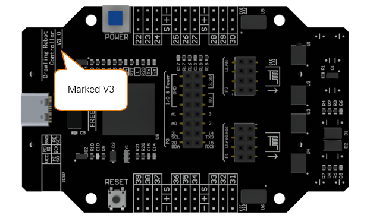
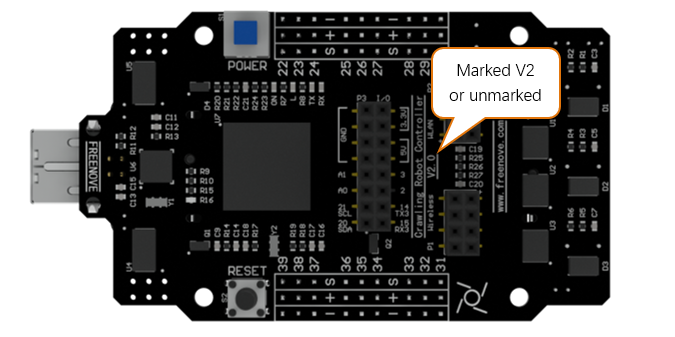

##############################################################################
Note
##############################################################################

You can refer to this video to assemble the robot: https://youtu.be/nivTZeGthf4

For remote control, please refer to this video: https://youtu.be/fK7IHMA60F4 

Please check the version of the control board included in the product you purchased first!

Note: Different versions of the control board use different types of batteries.

However, their functions are the same and they use the same code.

- If it is marked with V3, please buy battery according to “AboutBattery_for_V3.pdf” and assemble the robot according to this document.

- If it is marked with V2 or unmarked, please buy battery according to “AboutBattery_for_V2.pdf” and assemble the robot according to “Tutorial_for_V2.pdf”.

