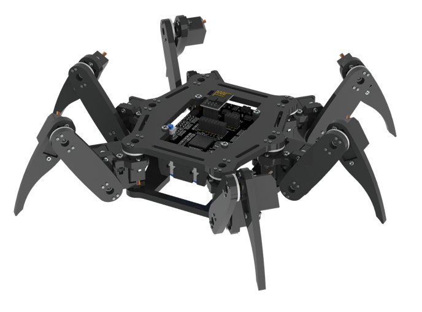

##############################################################################
Preface
##############################################################################

This is a robot kit compatible with Arduino IDE and Processing IDE, which are both free and open source software that can be run on Windows, macOS and Linux computers. We will have a detailed introduction later.

You can use this kit to assemble a cool robot and control it to move and act wirelessly. You can also directly control the IO ports on control board. In details, you can use the following devices to control the robot:

- Laptop or desktop with Wi-Fi adapter. (Run Windows, macOS or Linux, including Raspberry Pi OS)

- Android phone or tablet. (Run Android 5.0 or later version, installed Freenove App from Google Play.)

- iPhone. (Run iOS 10 or later version, installed Freenove App from App store.)

- Remote. (Freenove Remote Control Kit, FNK0028)

We provide complete code, but you can also write code for this robot by yourself easily. By using the code library we provided, you only need to write a few lines of code to control the action and movement of the robot. You can also connect sensors and modules to the IO ports and power ports on the control board.

The assembled robot is shown below (the wires are not shown).

