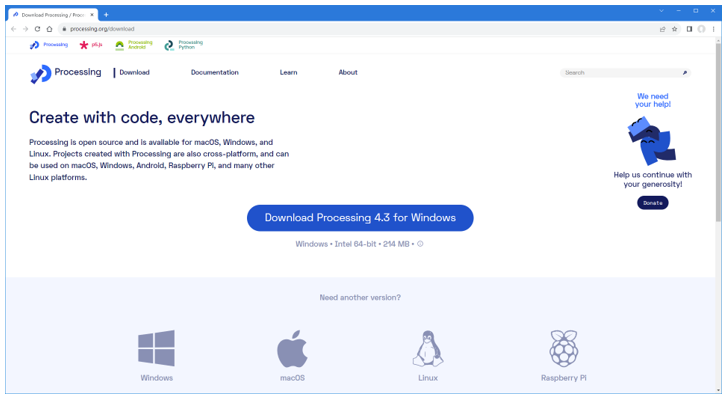
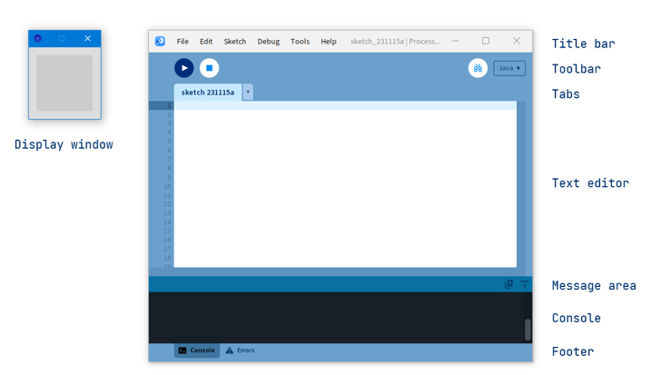
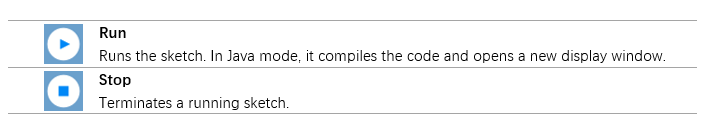
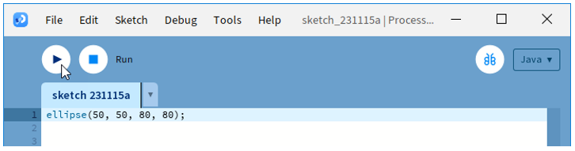
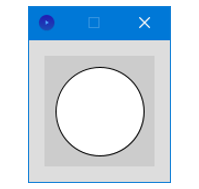
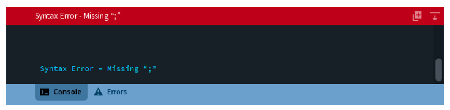
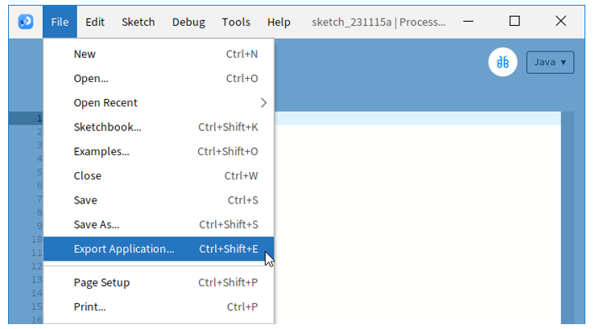

##############################################################################
Processing IDE
##############################################################################

! Please do not skip this chapter if you have never installed Processing IDE or are not familiar with it.

The Processing IDE is free and open source. It is used to write graphical programs run on computers. Most code written with it can run directly on Windows, macOS and Linux without any changes.

We provide a Processing sketch to configure and control the robot.

Processing IDE
*****************************************************************************

Processing IDE uses Java by default. Please visit https://processing.org/reference/ for details.

Do not worry if you do not know Java, because we provide complete code.

**! If you have already installed an earlier version, we recommend uninstalling it before continuing.**

First, install Processing IDE. Visit https://processing.org/download. Then select and download corresponding installer according to your operating system.

We will explain in the Windows version. The other versions are similar.

Installation on each machine is straightforward:

- On Windows, you'll have a .zip file. Double-click it, and drag the folder inside to a location on your hard disk. It could be Program Files or simply the desktop, but the important thing is for the processing folder to be pulled out of that .zip file. Then double-click processing.exe to start.- 

- The Mac OS X version is also a .zip file. Double-click it and drag the Processing icon to the Applications folder. If you're using someone else's machine and can't modify the Applications folder, just drag the application to the desktop. Then double-click the Processing icon to start.- 

- The Linux version is a .tar.gz file, which should be familiar to most Linux users. Download the file to your home directory, then open a terminal window, and type:

  *tar xvfz processing-xxxx.tgz*

  (Replace xxxx with the rest of the file's name, which is the version number.) This will create a folder named processing-2.0 or something similar. Then change to that directory:

  *cd processing-xxxx*

  and run it:

  *./processing*

With any luck, the main Processing window will now be visible. Everyone's setup is different, so if the program didn't start, or you're otherwise stuck, visit the troubleshooting page for possible solutions.

The buttons on the toolbar can run and stop programs:

Programs written using Processing IDE are called sketches and are saved with the file extension .pde.

Please visit https://processing.org/environment for more details.

First Use
********************************************************************************

In the editor, type the following:

.. code-block:: java

    ellipse(50, 50, 80, 80);

This line of code means "draw an ellipse, with the center 50 pixels over from the left and 50 pixels down from the top, with a width and height of 80 pixels".

Click the “Run“ button.

If you've typed everything correctly, you'll see a circle on your screen.

If you didn't type it correctly, the Message Area will turn red and complain about an error. If this happens, make sure that you've copied the example code exactly: the numbers should be contained within parentheses and have commas between each of them, and the line should end with a semicolon.

You can export Processing sketch to an application to run it directly without opening the Processing.

To export the sketch to the application, you must save it first.

So far, we have completed the first use. I believe you have felt the joy of it.