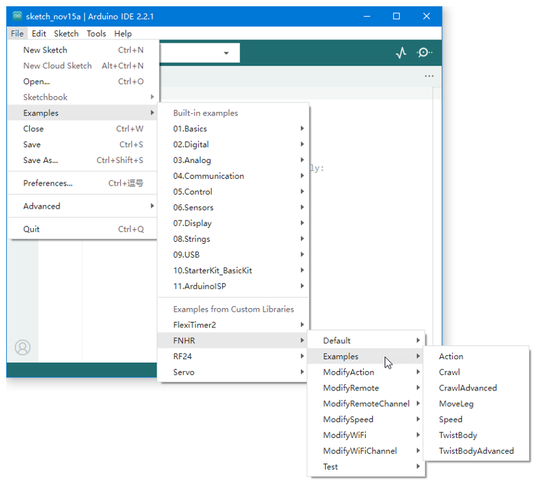
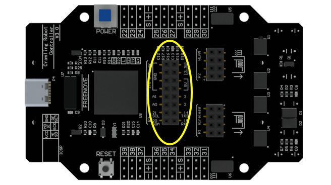
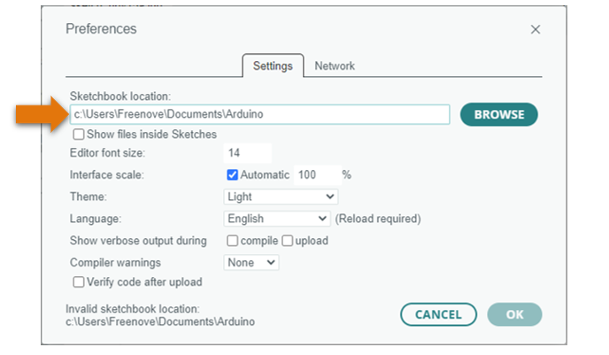

##############################################################################
Programming
##############################################################################

It is easy to reprogram this robot.

Modify Default Sketch
********************************

If you just want to modify the parameters of the default functions, it is very simple.

**! In this case, all previous functions will not be affected except the parameters you want to modify.**

Just add the corresponding functions under the following line in the default sketch.

.. code-block:: c
    
    robot.Start(true);

**! Only the functions mentioned in this section can be added.**

**! Other codes of default sketch cannot be modified or deleted.**

You can modify the Wi-Fi hotspot name and password by calling the following function.

.. code-block:: c
    
    void FNHR::SetWiFi(String name, String password)

Please open "File" > "Examples" > "FNHR" > "ModifyWiFi" > "Robot" to see how to use.

When there are many Wi-Fi signals nearby, you may not be able to connect to the robot or the signal will be poor. Then you can try to modify the channel by calling the following function.

.. code-block:: c
    
    void FNHR::SetWiFiChannel(byte channel)

You can modify the wireless communication address between robot and remote.

To modify the robot, call the following function.

.. code-block:: c
    
    void FNHR::SetRemote(byte byte0, byte byte1, byte byte2, byte byte3, byte byte4)

To modify the remote, call the following function.

.. code-block:: c
    
    void FNHRRemote::Set(byte byte0, byte byte1, byte byte2, byte byte3, byte byte4)

You must set them to the same address to control robot with the remote.

Please open "File" > "Examples" > "FNHR" > "ModifyRemote" to see how to use.

You can also modify the wireless communication channel between robot and remote.

To modify the robot, call the following function.

.. code-block:: c
    
    void FNHR::SetRemoteChannel(byte byte0, byte byte1, byte byte2, byte byte3, byte byte4)

To modify the remote, call the following function.

.. code-block:: c
    
    void FNHRRemote::SetChannel(byte byte0, byte byte1, byte byte2, byte byte3, byte byte4)

You must set them to the same channel to control robot with the remote.

Please open "File" > "Examples" > "FNHR" > "ModifyRemoteChannel" to see how to use.

You can modify the action speed by calling the following function.

.. code-block:: c
    
    void FNHR::SetSpeed(float speed)

Please open "File" > "Examples" > "FNHR" > "ModifySpeed" to see how to use.

You can modify the action speed of the robot body by calling the following function.

.. code-block:: c
    
    void FNHR::SetActionSpeed(float speed)

Please open "File" > "Examples" > "FNHR" > "ModifySpeed" > "Robot" to see how to use.

You can modify the action group by calling the following function.

.. code-block:: c
    
    void FNHR::SetActionGroup(int group)

There are three different action groups, which determine the way robot moves and turns.

Please open "File" > "Examples" > "FNHR" > "ModifyAction" > "Robot" to see how to use.

Custom Programming
******************************

You can also write a new sketch to control the robot by including FNHR library.

**! In this case, the robot is controlled only by your code.**

Processing App, Android App and remote will no longer work.

**! You can add any code you need, not just the functions mentioned in this section.**

**! You can add sensors and other modules, and the P3 I/O port on the control board is also available.**

Create a new blank Arduino sketch, including FNHR library at the beginning.

.. code-block:: c

    #include <FNHR.h>

Then define a robot object.

.. code-block:: c

    FNHR robot;

In function setup(), start the robot as follows.

.. code-block:: c

    void setup() {
        robot.Start();
    }

Now, you can directly use the following code in function loop() to control the robot.

.. code-block:: c

    robot.ActiveMode();
    robot.SleepMode();
    robot.SwitchMode();
    robot.CrawlForward();
    robot.CrawlBackward();
    robot.CrawlLeft();
    robot.CrawlRight();
    robot.TurnLeft();
    robot.TurnRight();
    robot.Crawl(float x, float y, float angle);
    robot.ChangeBodyHeight(float height);
    robot.MoveBody(float x, float y, float z);
    robot.RotateBody(float x, float y, float z);
    robot.TwistBody(float xMove, float yMove, float zMove, float xRotate, float yRotate, float zRotate);
    robot.LegMoveToRelatively(int leg, float x, float y, float z);
    robot.SetActionSpeed(float speed);
    robot.SetActionGroup(int group);

There are some examples in"File" > "Examples" > "FNHR" > "Examples ". You can open and upload them to learn how to use FNHR library to control the robot.

The control board provides some IO and power ports for your use. They are not used by this robot in default.

If you want to add other parts for this robot. Please refer to "File" > "Examples" > "FNHR" > "Examples” for to build your own programming.

In the default robot code, these ports cannot be programmed.

Complete Reprogramming
***************************

It is NOT recommended that you use your own code to control every servo, which is more difficult and it may easily damage the servos.

If you want to learn the details of the code, you can view the FNHR library source code.

All the library files already added to Arduino IDE are in the "libraries" folder under "Sketchbook location" in the “File” > ”Preferences” window.

And if you want to learn the details about the control board, please find the schematic in the folder.

If you have any questions, please contact our support for help.

Hardware
*****************************

Please find the circuit diagrams of the boards in the “Hardware” folder.

If FNHR library is used, the reference voltage of analog input may be switched to an external.

- On V2 and later board: the reference voltage is 2.094V.

- On other versions of boards: the reference voltage is 5V by default.

If using a port as an analog input, the voltage that can be measured ranges from 0V to reference voltage.

If the voltage to be measured is higher than the reference voltage, use two resistors to divide the voltage.